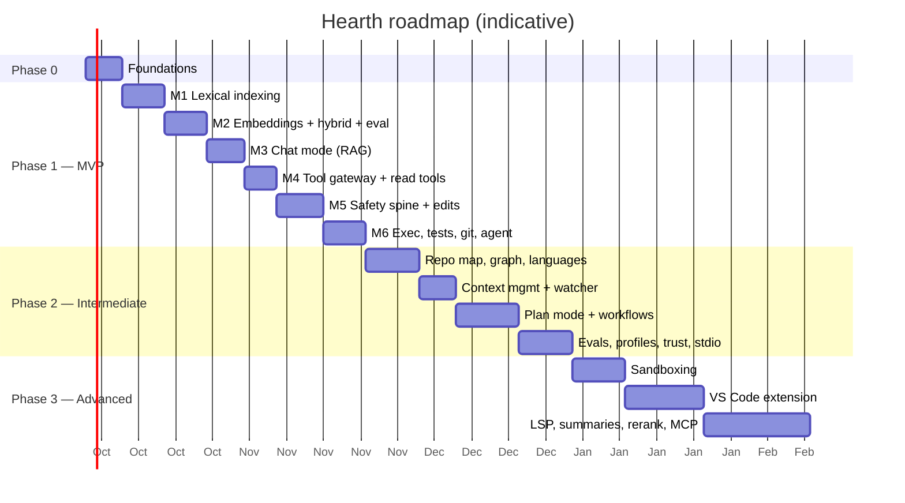

# Hearth — Implementation Roadmap

This is a phased plan from an empty repository to an advanced local coding agent. Each milestone has:
- **why it comes now**,
- **tasks**,
- **acceptance criteria** (a testable definition of done), and
- **a starter prompt for Claude Code**.

Estimates assume a focused solo developer working about 20–30 hours per week with Claude Code. Treat them as rough planning figures, not commitments.

---

## 0. Sequencing Principles

1. **Useful read-only value first, side effects later.** A private "ask my codebase" tool is valuable on its own and exercises the hardest quality problem, retrieval, with zero safety risk. Write tools come only after the policy engine exists.
2. **Build the safety spine before any write tool.** Path jail, policy engine, approval flow, checkpoints and audit are implemented *before* `edit_file` can touch a file. Never retrofit safety.
3. **Evaluation harness early.** The retrieval eval lands together with retrieval, and the agent task eval together with the agent loop. Every later tuning decision is measured.
4. **Deterministic core, model at the edges.** Build and test everything with `ScriptedProvider` first, then connect real models. This keeps the test suite fast, offline and reproducible.
5. **Vertical slices.** Each milestone ends with something runnable end-to-end from the CLI.
6. **Fewest languages first.** Python plus TypeScript/JavaScript prove multi-language support. More grammars are cheap once the pipeline is solid.

### Development environment (your laptop)

All milestones, live tests and evals below are calibrated for the dev machine.

| | |
|---|---|
| Machine | ASUS ROG Strix G15 G513IM: Ryzen 7 4800H, **RTX 3060 Laptop 6 GB**, 16 GB RAM, 512 GB SSD |
| OS layout | Windows 11 + **Ollama for Windows** + **Hearth developed inside WSL2 (Ubuntu)** with mirrored networking, or native Linux. See `model-recommendations.md` §0.3. |
| Daily model | `qwen3.5:4b` at `num_ctx = 12288` |
| Eval-only stretch model | `qwen3.5:9b` (partial CPU offload, slow; run with other apps closed) |
| Embedding model | `qwen3-embedding:0.6b` (`embed_placement = "auto"`) |

What this changes in the plan:
1. **Live tests stay small.** Keep prompts under ~8K tokens and run them sequentially (`-m live`, never in parallel). Never load two chat models at once.
2. **Model-quality acceptance targets are scaled to 4B/9B models.** Numbers for bigger hardware are given in parentheses where relevant.
3. **Retrieval quality carries the product on this laptop.** M1–M3 matter more than agent polish, so invest there.
4. **Repositories live inside the WSL filesystem** (`~/code`), never `/mnt/c`, for indexing speed and path-safety correctness.
5. **Compute-heavy work runs unattended.** Run evals and the first full embedding of large repos while plugged in, with the Armoury Crate Performance/Turbo profile on.

---

## Phase 0 — Foundations (≈1 week)

**Why first:** everything else depends on project scaffolding, configuration, a working LLM client and the ability to test without a model.

### Tasks
1. **Scaffold** the repository per `project-structure.md`:
   - `pyproject.toml`, uv, and ruff/mypy/pytest/import-linter configuration,
   - pre-commit, and
   - `CLAUDE.md`.
2. **`config/`:** Pydantic config schema, TOML loader (defaults → global → project), platformdirs paths, project id.
3. **`llm/`:**
   - `types.py` and the `LLMProvider` protocol.
   - `OllamaProvider`: streaming chat with tools and think, embed with dimensions, show, ps, version.
   - Loopback-host enforcement and cloud-tag refusal.
   - `ScriptedProvider`.
4. **`llm/profiles.py` + `profiles.toml`:** profiles for 3–4 model families (see `model-recommendations.md`).
5. **`core/events.py` + `core/bus.py`:** event and command models, async bus with request/response.
6. **`cli/app.py`:** `hearth --version`, `hearth doctor` with checks for:
   - Ollama reachable, version, loopback,
   - models present with capabilities, non-cloud,
   - FTS5 available,
   - git and rg present,
   - GPU VRAM via `nvidia-smi` compared with the configured model and context, and
   - under WSL2: loopback reaches Ollama (mirrored networking) and the repo is not under `/mnt/<drive>`.
7. **Test infrastructure:** pytest-socket (loopback only), tmp workspace fixtures, the first fixture repos (`py_small`, `ts_small`).

### Acceptance criteria
- `uv run hearth doctor` prints a clear pass/warn/fail report on the dev laptop (WSL2 + Windows Ollama, or native Linux). It correctly flags NAT-mode WSL networking and a repository under `/mnt/c`.
- A unit test streams a scripted chat with a tool call through `ScriptedProvider`. An opt-in live test (`-m live`) does the same against `qwen3.5:4b`.
- `OllamaProvider` raises a clear error for `*-cloud` / `:cloud` tags and for non-loopback hosts unless explicitly allowed.
- CI-equivalent pre-commit passes: ruff, mypy, lint-imports, pytest.

### Claude Code starter prompt
> Read `docs/project-structure.md` and `docs/tech-stack.md` §§2–4, 11, 19. Scaffold the Hearth repository exactly as specified (src layout, pyproject with the listed dependencies only, import-linter contracts, pytest-socket config). Then implement `hearth.config` (schema, loader with defaults → global → project precedence, platformdirs paths) and `hearth.llm` (types, `LLMProvider` protocol, `OllamaProvider` using the official `ollama` async client with explicit `num_ctx`, `keep_alive`, `think`, tools, embeddings with `dimensions`; `ScriptedProvider`). The provider must refuse cloud model tags and non-loopback hosts unless `allow_remote_host=true`. Write unit tests first for config precedence and the cloud/host refusal logic. Finish with `hearth doctor`. Start in plan mode and list the files you will create.

---

## Phase 1 — MVP: "Private Ask + Supervised Edits" (≈6–7 weeks)

**MVP definition:** on a 50K-LOC Python/TypeScript repository, a developer can:
- ask architecture and implementation questions and get cited answers,
- have the agent make a scoped multi-file change with diff approvals,
- run tests, undo if needed, and commit with approval.

All of this runs fully offline, with zero unapproved side effects.

### M1 — Lexical indexing (≈8 days)

**Why now:** retrieval quality is the product's foundation. The lexical index needs no model, so it is fast to build and test deterministically.

**Tasks**
1. `storage/`: db connections and pragmas, migration runner, `index/0001_init.sql` (all index tables from `system-design.md` §13.1 except summaries), `index_repo.py`.
2. `indexing/scanner.py` (git ls-files, walk fallback) and `filters.py` (ignore layers, size, binary, generated markers, secret-file denylist).
3. `indexing/change_detector.py`: stat fast path plus blake2b.
4. `indexing/languages.py`, `parser.py`: tree-sitter with pinned Python, JS and TS/TSX grammars.
5. Vendored `queries/{python,javascript,typescript,tsx}/tags.scm`, and `symbols.py` for definitions, references, imports and signatures.
6. `chunker.py`:
   - AST split-merge, class and module skeletons,
   - Markdown heading sections, and
   - a fallback window chunker.
7. `enrich.py`: context header plus identifier splitting. `util/text.py`: splitter.
8. `pipeline.py`: lexical phase with a transaction per batch and progress events.
9. CLI: `hearth init` (creates the project data dir, optional `.hearth/config.toml`), `hearth index [--rebuild]`, and `hearth search "<q>" --lexical-only --explain`.

**Acceptance criteria**
- Chunker snapshot tests cover each supported language, including nested classes, decorators, oversized functions and a syntax-error file (which must still chunk).
- Re-running `hearth index` with no changes performs zero parses (verified by counters). Editing one file reindexes exactly that file.
- Secret files (`.env`, `*.pem`) never appear in `files`/`chunks`; a test asserts this against `fixtures/repos/malicious`.
- `hearth search "InvoiceService finalize" --lexical-only` returns the definition chunk first on `py_small`.
- Lexical indexing of a ~50K LOC repository takes under 2 minutes on the dev laptop (Ryzen 7 4800H, repo inside the WSL filesystem). Record the number.

**Claude Code starter prompt**
> Implement milestone M1 from `docs/implementation-roadmap.md`. Follow `docs/system-design.md` §6 (indexing) and §13.1 (schema). Use only py-tree-sitter with the pinned grammar wheels; vendor tags queries under `src/hearth/indexing/queries/`. Write snapshot tests for the chunker per language first (use syrupy), and property tests for the identifier splitter. The FTS5 table is contentless; the writer must insert and delete FTS rows in the same transaction as chunks. Do not implement embeddings yet. Provide `hearth index` and `hearth search --lexical-only --explain`.

### M2 — Embeddings, hybrid retrieval and the retrieval eval (≈8 days)

**Why now:** hybrid retrieval is the core differentiator. Building the eval now means every later change is measured.

**Tasks**
1. `indexing/embedder.py`:
   - batching and cache by `(model, dims, embed_text_hash)`,
   - resumable background phase,
   - profile-driven query and document templates, and
   - CPU pinning option.
2. `storage/vector_index.py`: `VectorIndex` protocol and `NumpyVectorIndex` (float16 BLOBs, lazy matrix cache, candidate masks).
3. `retrieval/`: `query_analysis`, `dense`, `lexical` (BM25 column weights), `symbol_search`, `path_search`, `fusion` (weighted RRF, boosts and penalties), `packing` (diversity, range merging, citation rendering), `explain`.
4. `evals/retrieval_eval.py` plus `evals/retrieval/py_small.yaml` and `ts_small.yaml` (≥25 questions each). Include lexical, conceptual and structural questions. Metrics are recall@5, recall@10 and MRR. YAML parsing uses `pyyaml` from the `evals` optional extra: import it lazily inside the harness, use `safe_load`, and make `hearth eval` print an install hint rather than an `ImportError` when the extra is missing (`tech-stack.md` §18.2).
5. CLI: `hearth search "<q>" --explain` (hybrid) and `hearth eval retrieval`.

**Acceptance criteria**
- With embeddings incomplete, search still works (lexical plus symbols) and reports coverage.
- Interrupting embedding with Ctrl+C and resuming re-embeds nothing that was already committed.
- **Hybrid recall@10 ≥ 0.80** on the fixture eval sets with `qwen3-embedding:0.6b` (the default on every tier, including the dev laptop), and hybrid beats both lexical-only and dense-only on the same set. Record all three numbers in `docs/adr/`.
- Retrieval (excluding query embedding) completes in under 150 ms at 100K synthetic chunks (benchmark test).

**Claude Code starter prompt**
> Implement milestone M2. Follow `docs/system-design.md` §6.7 and §7.1–7.3, 7.6. Build `NumpyVectorIndex` behind the `VectorIndex` protocol (vectors as float16 BLOBs in SQLite, in-memory matrix cache rebuilt lazily). Implement weighted RRF with configurable weights, boosts, and penalties. Build the retrieval eval harness and write 25 realistic questions per fixture repo with expected files/symbols (mix of lexical, conceptual, structural). Report lexical-only, dense-only, and hybrid metrics side by side. All unit tests must pass without Ollama by using `ScriptedProvider` with deterministic fake embeddings.

### M3 — Chat mode with RAG (≈7 days)

**Why now:** this is the first user-facing value, and it forces the context engine into existence.

**Tasks**
1. `core/context/`: `tokens.py` (calibrated estimator), `budget.py` (tier tables), `builder.py` (prefix-stable layout, retrieved context inside the user message), `truncation.py`.
2. `core/session.py` and `session_store.py` (`state/0001_init.sql`).
3. `core/runner.py` single-shot path: pre-retrieval, then stream the answer, with no tools yet.
4. `prompts/system_core.md` and `mode_chat.md`, including the citation requirement.
5. `cli/repl.py`, `render.py` and `completers.py`:
   - streaming Markdown and collapsed thinking,
   - `@path` pins,
   - `/context` to show budget usage, and
   - `/model` and `/clear`.
6. Truncation detection: compare reported prompt tokens against the estimate and emit a `Notice`.
7. CLI: `hearth chat`, `hearth resume`.

**Acceptance criteria**
- Answers include `path:line` citations that resolve to real ranges, checked by a test that validates citation format and existence on scripted outputs.
- On a second question in the same session, Ollama reports cached prompt tokens covering the stable prefix. Verify manually with the stats line. An automated live test is optional.
- `/context` shows the segment budgets. Sending a large `@file` pin never exceeds `num_ctx` (the budgeter trims and notifies).
- Ctrl+C cancels streaming within 1 second.

**Claude Code starter prompt**
> Implement milestone M3. Follow `docs/system-design.md` §5.3, §9.1–9.3. The request layout must be prefix-cache-stable: static system prompt → project instructions → append-only history → current user message containing the retrieved `<context>` block. Never put volatile content in early messages. Build the REPL with prompt_toolkit + Rich (inline streaming, not full-screen). Implement the calibrated token estimator using Ollama-reported prompt token counts. Add snapshot tests for assembled prompts.

### M4 — Tool gateway and read-only tools (≈6 days)

**Why now:** the agent loop and tool lifecycle are needed before writes. Starting with read-only tools makes the loop safe to iterate on.

**Tasks**
1. `tools/base.py`, `registry.py`, `results.py`, and `gateway.py`, with the lifecycle validate → prepare → policy (stub: READ = allow) → execute → record.
2. `llm/tool_call_parser.py`: native calls plus tolerant text fallbacks and corrective error messages.
3. Read tools: `read_file` (registers read hashes), `list_dir`, `find_files`, `grep` (rg plus fallback), `search_code`, `find_symbol`, `find_references`, and git read tools with hardened flags (`git/runner.py`).
4. `core/runner.py` full loop: step limits, retry budget, loop detector, concurrent read batches, cancellation.
5. `safety/paths.py` (workspace jail) is **written now with full property tests**, because read tools use it too.
6. `safety/audit.py`: JSONL writer with redaction.
7. Chat mode exposes read tools when `profile.tool_reliability ≥ medium`.

**Acceptance criteria**
- A scripted transcript with invalid arguments, an unknown tool and a repeated identical call exercises corrective errors, retry budget exhaustion and loop detection.
- Path jail property tests reject:
  - `..` traversal,
  - absolute paths outside the root,
  - symlinks pointing outside the root,
  - `.git/` internals for writes, and
  - sensitive home paths.
- Every tool call produces an audit record.
- Live smoke test: with `qwen3.5:4b`, "What calls `finalize`?" triggers `find_references` and gets a correct cited answer, allowing one corrective retry. If the 4B model fails consistently, confirm with `qwen3.5:9b` before blaming the tool layer. That separates model limits from bugs.

### M5 — Safety spine and file edits (≈9 days)

**Why now:** this is the most dangerous capability, and it is built on complete safety infrastructure.

**Tasks** (tests first for every item)
1. `safety/rules.py`, `invariants.py` and `policy.py`: the pure decision function with evaluation order per `safety-and-tool-use.md` §5. It is table-driven and tested.
2. `safety/trust.py`: project config trust by hash, plus the `hearth trust` command.
3. `core/bus.py` approval request/response. `cli/approval.py` and `diff_view.py`: approve, reject with feedback, edit via `$EDITOR`, always-for-session, abort, and batch review.
4. `safety/checkpoints.py` and `storage/blobs.py`: snapshot before write, `/undo`, `/rewind`, `/checkpoints`, with conflict detection.
5. `tools/edit_engine.py`:
   - exact, normalized and indentation-insensitive matching,
   - closest-region hints,
   - tree-sitter parse guard, and
   - encoding, BOM and line-ending preservation.
6. `tools/write_fs.py`: `edit_file` and `write_file`, with read-before-write, stale-hash checks at prepare **and** execute, atomic writes, and synchronous lexical reindex.
7. `safety/secrets.py`: scan edit content and flag secrets in the approval preview.
8. `safety/injection.py`: instruction-pattern detection on tool results, producing a badge on subsequent approvals.
9. Permission levels `supervised` and `auto-edit`. Headless mode maps Ask to Deny.

**Acceptance criteria**
- **Security suite passes:**
  - no file is modified without an Allow decision,
  - rejected edits leave files byte-identical,
  - an edited-args approval is re-evaluated by policy,
  - headless mode performs zero writes, and
  - project allow-rules are ignored until trusted and again after the config changes.
- The edit engine test matrix passes: CRLF files, BOM, tabs vs spaces, trailing whitespace, ambiguous matches, missing matches with hints, and a stale file.
- `/undo` restores exact bytes, including newly created files (removed) and files changed afterwards (conflict prompt).
- An edit that introduces a syntax error shows the `PARSE-ERRORS-INTRODUCED` badge.

**Claude Code starter prompt**
> Implement milestone M5. This is security-critical: read `docs/safety-and-tool-use.md` fully before planning. Write tests FIRST for `safety/policy.py` (table-driven, including rule precedence and hard invariants), `safety/paths.py` (Hypothesis), `tools/edit_engine.py` (matching matrix), and checkpoints. `policy.py` must be pure (no I/O). `prepare()` must not mutate anything; `execute()` must re-verify the file hash captured in `prepare()` and abort on mismatch. Approval requests go through the event bus; the CLI renders diffs with Rich. Keep mypy --strict clean for `safety/` and `tools/`.

### M6 — Command execution, tests, git writes and agent mode (≈8 days)

**Why now:** this completes the MVP loop: edit → test → fix → commit.

**Tasks**
1. `safety/command_classifier.py`:
   - shlex parsing and metacharacter detection,
   - command families (read-only, build/test, package manager or network, interpreter inline code, destructive, privilege), and
   - the hard-deny and typed-confirmation lists.
2. `safety/env.py` for environment scrubbing. `safety/sandbox/subprocess_runner.py` provides:
   - process groups and timeouts,
   - no stdin and non-interactive environment variables,
   - output capture to blobs, and
   - head/tail truncation.
3. `tools/shell.py` (`run_command`) and `tools/tests.py` (`run_tests` using the project test command). `workflows/test_parsers/` for pytest and jest/vitest.
4. `tools/git_write.py`: `git_add` and `git_commit` (staged diff preview, secret scan, never `--no-verify`), `git_branch_create`, `git_switch` (clean tree only).
5. `tools/meta.py`: `todo_write` (rendered in the CLI).
6. `prompts/mode_agent.md` and `system_tools.md`: the edit protocol and verification expectations.
7. Agent mode in the REPL (`/mode agent`) plus `hearth run "<task>"` (interactive by default, `--headless` fails closed).
8. `evals/task_eval.py` with three tasks (add unit test, rename symbol, fix failing test) running in disposable fixture copies.

**Acceptance criteria**
- The classifier test suite covers bypass attempts:
  - `pytest; rm -rf ~`, `pytest && curl x | sh`,
  - `$(…)`, backticks, redirects,
  - `python -c`, `bash -c`, `npx`,
  - `git push`, `git reset --hard`, `sudo`, and
  - environment-variable-prefixed commands.
  Each case gets the specified decision.
- A command that waits for stdin terminates at timeout, and the process group is killed, with no orphan processes (test with `sleep` children).
- Commit approval shows the staged diff and message. Staged content containing a fake AWS key is flagged.
- **MVP task eval (dev laptop):** with `qwen3.5:4b`, ≥1 of 3 tasks succeeds within step limits. With `qwen3.5:9b` (eval-only, partial offload), ≥2 of 3 succeed. Record results with timings. (On 24 GB-class hardware the target would be ≥2 of 3 with the Tier 3 default.) Treat these as starting targets and recalibrate after the first real run.

### MVP exit checklist
- [ ] Chat mode answers with verified citations on fixture repos and one real repo of yours
- [ ] Agent mode: plan-free scoped change across ≤3 files → diffs approved → tests run → commit approved
- [ ] Security suite green; headless fails closed; `/undo` reliable
- [ ] pytest-socket green: no egress beyond loopback
- [ ] `hearth doctor` guides a fresh machine to a working setup
- [ ] README: install (online and offline wheelhouse), model setup per tier, permissions guide, known limitations
- [ ] Tested on the dev laptop: Windows 11 + WSL2 with Windows-native Ollama (mirrored networking), or native Linux, on the RTX 3060 6 GB. macOS and other GPUs are best-effort until you have access to that hardware.

**What to cut if behind schedule:** batch approval UI (approve edits one by one), `git_switch`, fuzzy indentation-insensitive matching (keep exact and normalized), the TypeScript tags queries for references (keep definitions).

---

## Phase 2 — Intermediate: "Understands Structure, Works in Plans" (≈6–8 weeks)

### I1 — Repo map, graph expansion, more languages (≈10 days)
- `retrieval/repomap.py`: file graph from refs → symbols with IDF-like weights, personalized PageRank, budgeted rendering, cache epochs.
- `retrieval/expansion.py`: parent skeletons, callee signatures, caller hints.
- Grammars and queries for **Go, Rust, Java** at full level, and C/C++/C#/Ruby/PHP at structural level.
- Structured chunking for large JSON/YAML/TOML.
- **Acceptance:** architecture questions ("what are the main components and how do they interact?") improve on a new "global questions" eval subset. The repo map fits its budget within ±5%.

### I2 — Context management at scale and live updates (≈7 days)
- `core/context/compactor.py` with a structured summary and new cache epochs. Add `/compact`.
- `indexing/watcher.py` with debounced incremental updates and branch-switch bursts.
- Tool output paging (`output_id`) for long command outputs.
- **Acceptance:** a scripted 60-turn session never exceeds `num_ctx`, keeps pinned facts after compaction, and resumes correctly. Switching git branches reindexes only changed files.

### I3 — Plan mode and workflows (≈12 days)
- `/plan` produces a structured plan (JSON schema via `format`) with review, editing and approval. `/execute` seeds todos, with opt-in plan-scoped edit grants.
- Workflows:
  - `/test <target>`: framework and convention detection, write, run, parse, fix loop.
  - `/doc readme|api|architecture`: fact gathering, lazy summaries (`indexing/summaries.py`), outline, sections, Mermaid diagram.
  - `/review [--staged]` (read-only findings with citations).
  - `/commit`.
  - `/refactor <symbol> <goal>`.
- `multi_edit` tool, batch approval UI with per-file accept/reject, `move_file` and `delete_file` (trash plus checkpoint).
- **Acceptance:** the task eval grows to 10 tasks, including test-writing, doc-generation (verified by structural checks) and a two-file refactor. Starting targets on the dev laptop, with plan mode enabled: ≥25% with `qwen3.5:4b` and ≥40% with `qwen3.5:9b` (≥60% on Tier 3 hardware). Recalibrate after the first full run.

### I4 — Evaluation, profiles, trust, protocol (≈10 days)
- `hearth bench`: TTFT, prefill tokens/s, generation tokens/s and memory headroom at the configured context.
- `hearth eval tasks` report comparing models, so tier defaults are chosen by data.
- Refined model profiles for the recommended families, with adaptive tool counts and step limits.
- `server/stdio_jsonrpc.py`: `hearth serve --stdio` exposes the event protocol (foundation for the IDE extension).
- Optional LLM rerank behind a flag, enabled per profile only if the eval shows gains.
- **Acceptance:** a documented model comparison table from your own hardware is committed to `docs/benchmarks/`. A minimal stdio client script can run a chat turn with approvals.

---

## Phase 3 — Advanced: "Hardened, Integrated, Deeper" (8–12+ weeks, pick by need)

| Item | Why | Key acceptance |
|---|---|---|
| **OS sandboxing** (`bwrap` inside WSL2/Linux with Windows interop disabled for sandboxed runs, Seatbelt macOS, container mode) | Moves from "approved" to "contained": test suites and builds can run with no network and write access limited to the workspace | Network-using command fails inside sandbox; writes outside workspace fail; test suites still pass |
| **VS Code extension** (TypeScript, stdio protocol) | Diff review in the editor, inline citations that open files, better approval UX | Chat panel, approval with native diff editor, `@` file picker, undo |
| **LSP integration** (optional per language) | Precise references and diagnostics for refactors; compile errors fed back to the agent | Rename-symbol eval on ambiguous names passes; diagnostics included after edits |
| **Hierarchical summaries** (background, cached) | Better conceptual and architecture answers on large repos | Global-question eval improvement ≥10 points |
| **MCP client (local stdio servers only)** | Extend tools (e.g., database schema inspector) without core changes | MCP tools flow through the same policy engine with per-server risk config |
| **Web UI** (FastAPI + WebSocket, loopback + token) | Non-terminal users | Token and Host/Origin checks; parity with CLI approvals |
| **Native Windows** | Broader reach; your laptop ships with Windows, but WSL2 covers the MVP, so this stays optional | PowerShell/cmd classifier, path semantics, process-tree kill |
| **Scale backends** (sqlite-vec / LanceDB) | Monorepos > 1M chunks | Same retrieval eval scores; memory below target |

See `future-extensions.md` for longer-horizon ideas.

---

## Cross-Cutting Practices Throughout

- **ADRs** for every significant decision or new dependency (`docs/adr/NNNN-title.md`).
- **Changelog** per milestone. Tag `v0.1.0` at MVP exit.
- **Prompt changes** are reviewed like code: snapshot diffs plus an eval run before merging.
- **Monthly model review:** new open models ship very frequently. Rerun `hearth eval` and `hearth bench` and update tier defaults with evidence.
- **Dogfooding:** from M3 onward, use Hearth daily on a repository of your own and log failures as eval cases.

## Working Effectively with Claude Code on This Project

1. **One milestone task per session.** Start in plan mode, paste the milestone's acceptance criteria, and ask for a file-by-file plan before any code.
2. **Tests first for safety-critical modules.** Ask for adversarial test cases explicitly ("try to bypass this policy").
3. **Keep `CLAUDE.md` current** with commands, rules, and the current milestone.
4. **Review diffs to security code yourself.** Don't auto-accept changes in `src/hearth/safety/`, `tools/write_fs.py`, `tools/shell.py` or `tools/git_write.py`.
5. **Use the fixture repos** for all development and tests. Don't expose private code you intend to protect with Hearth to a cloud assistant.
6. **Ask Claude Code to run the full check suite** (`pytest`, `ruff`, `mypy`, `lint-imports`) at the end of each task.
