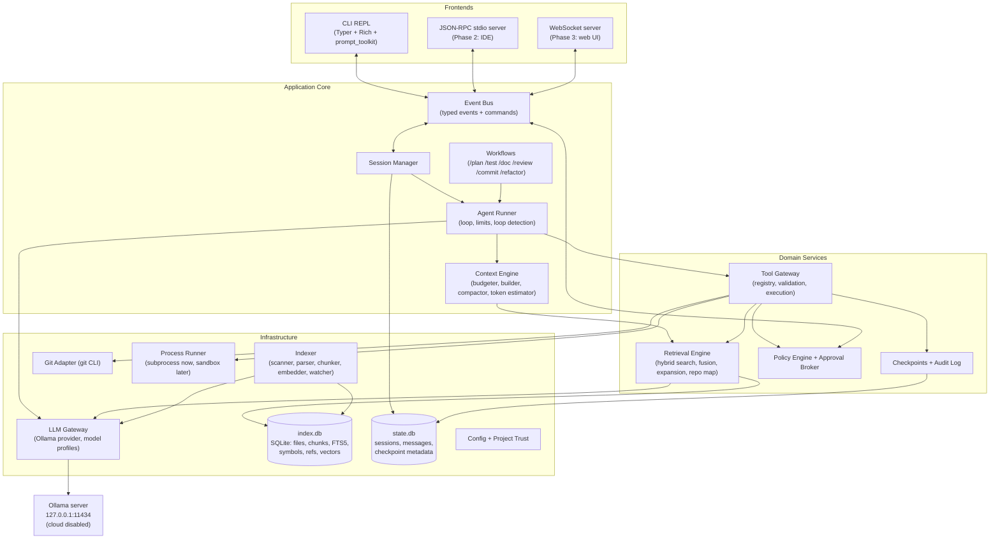
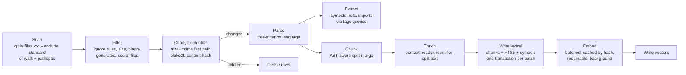
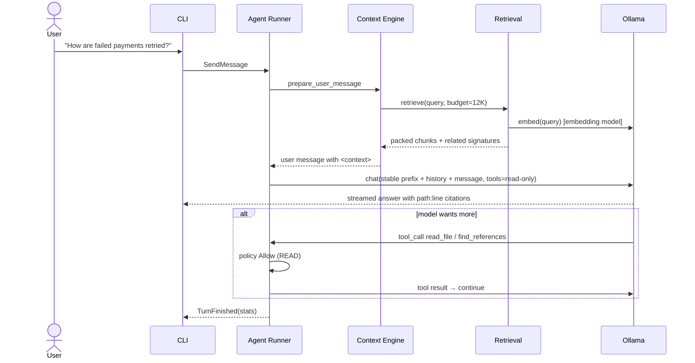

# Hearth — System Design

**A fully offline, private AI coding assistant and project agent built on local Ollama models.**

| | |
|---|---|
| Document status | v1.0 — design baseline |
| Date | September 2026 |
| Working name | **Hearth** (CLI: `hearth`). Rename freely; check PyPI/npm availability before publishing. |
| Companion docs | `tech-stack.md`, `project-structure.md`, `implementation-roadmap.md`, `model-recommendations.md`, `safety-and-tool-use.md`, `future-extensions.md` |

---

## 0. Executive Summary

Hearth is a terminal-first coding agent that indexes a local repository and answers questions about it with file:line citations. It proposes refactors, writes tests and documentation, and can edit files, run commands, run tests and use git. Every side effect needs explicit human approval. Everything runs on the developer's machine: models are served by a loopback-only Ollama instance, the index is a local SQLite file, and no code, prompt or telemetry ever leaves the machine.

The design is shaped by one dominant constraint. **Local models on consumer hardware have small usable context windows, slow prompt processing, and imperfect tool calling.** Nearly every decision below either compensates for that constraint or keeps the system simple enough for one developer to build and maintain.

The ten decisions that define the system:

1. **Hybrid code retrieval plus agentic search, not one or the other.** Retrieval combines lexical BM25, symbol lookup, dense embeddings and a structural repo map. It gives a cheap, accurate first hop. The model can then navigate further with `grep`, `read_file` and `find_references` tools.
2. **SQLite is the single system of record.** It holds metadata, FTS5, the symbol graph, sessions and checkpoints. Vectors are stored as BLOBs and searched exactly with NumPy. There is no separate vector database.
3. **Tree-sitter AST-aware chunking and symbol extraction**, with grammar wheels pinned at install time. Nothing is downloaded at runtime.
4. **A custom agent loop of about 400 lines** over the native Ollama API, with Pydantic-validated tools. No agent framework.
5. **Search/replace editing with strict matching**, read-before-write enforcement, stale-file detection, atomic writes and per-step checkpoints with `/undo`.
6. **A policy engine plus human approval as the primary safety control.** It fails closed, uses defense in depth, and the agent can never modify its own permissions. OS sandboxing is a later, additive layer.
7. **A headless core with a typed event protocol.** The CLI REPL comes first. IDE and web frontends plug into the same events later, and approval requests are just events that wait for a response.
8. **Deterministic scaffolding around the LLM.** Workflows such as `/test`, `/commit` and `/doc` gather facts, run verifications and parse results in code. The model is used only where judgment is needed.
9. **Context budgeting and prefix-cache-aware prompt layout** are first-class components, not afterthoughts.
10. **Evaluation from day one.** A retrieval eval set and an agent task suite decide which models, prompts and parameters to use. Benchmarks published by model vendors do not.

---

## 1. Deep Analysis: The Constraints That Drive the Design

### 1.1 The reality of local models

**Usable context is much smaller than advertised context.** Many current open models advertise 128K–256K windows, but the KV cache for those windows must fit in VRAM or unified memory next to the weights. A 16 GB GPU running a 9–12B model realistically supports 16K–32K tokens. A 24 GB card running a 27B model supports roughly 32K–64K depending on architecture and KV quantization. Quality also degrades well before the nominal limit. **Design consequence:** retrieval must be precise and context packing must be budgeted. Long sessions need compaction.

**Prompt processing (prefill) is often the latency bottleneck, not generation.** On a GPU, prefill runs at thousands of tokens per second and a 20K-token prompt is fine. On CPU-only or partially offloaded setups, prefill can drop to tens or low hundreds of tokens per second, so a 16K prompt can take minutes. **Design consequences:**
- Keep prompts lean on low tiers.
- Keep the prompt prefix byte-identical across turns so Ollama's KV prefix cache is reused.
- Never inject changing content (timestamps, fresh retrieval) before stable content.

**Silent truncation is a notorious Ollama failure mode.** Ollama applies a default context length that depends on available VRAM, and it can be far smaller than a coding agent needs. A prompt that exceeds `num_ctx` gets cut, and the system prompt or tool definitions can silently disappear. **Design consequences:**
- Hearth always sets `num_ctx` explicitly per request.
- It keeps that value constant within a session, because changing it forces a model reload.
- It budgets tokens before sending.
- It checks the prompt token counts Ollama returns against its own estimate.

**Tool calling is good but not perfect.** Recent mid-size models (Qwen 3.6/3.8, Gemma 4, Muse Glimmer) are explicitly trained for agentic tool use, but small models still sometimes:
- invent arguments,
- call tools that don't exist,
- emit tool calls as plain text, or
- loop.

**Design consequences:**
- Validate every call against a schema.
- Return corrective error messages the model can act on.
- Parse fallback formats.
- Detect loops.
- Reduce the number of tools exposed per mode.
- Scale autonomy (step limits, tool count) with a per-model reliability profile.

**Quantization matters.** Four-bit weights are the practical default for 20B+ models. Small models lose proportionally more from aggressive quantization, and code is unforgiving: one wrong token breaks a build. See `model-recommendations.md`.

**Model swapping costs seconds.** The chat model and embedding model may compete for VRAM. **Design consequences:**
- Use one main chat model per session.
- Use a small embedding model that can run on CPU when VRAM is tight.
- Set explicit `keep_alive` values and preload the model at session start.

### 1.2 What "understanding a codebase" actually requires

Questions developers ask fall into four classes, and each needs a different kind of retrieval:

| Question class | Example | Best signal |
|---|---|---|
| **Lexical / exact** | "Where is `STRIPE_WEBHOOK_SECRET` used?" | BM25, grep, symbol table |
| **Semantic / conceptual** | "How do we handle failed payments?" | Dense embeddings (+ summaries) |
| **Structural / relational** | "What calls `InvoiceService.finalize`?" "What depends on the auth module?" | Symbol and reference graph, import graph |
| **Architectural / global** | "Explain the overall architecture." "What are the main entry points?" | Repo map (ranked skeleton), manifests, directory summaries |

A pure-embedding RAG system (the typical tutorial approach) handles only the second class well. A pure grep-based agent (Claude Code's approach with frontier models) handles all four, but it needs many tool round trips, a large context and strong reasoning. On local hardware, each round trip may cost 10–60 seconds. Hearth therefore gives the model a strong, cheap starting context from all four signals, and *also* gives it navigation tools to dig further.

### 1.3 RAG vs. agentic search: why both

**Agentic search** means the model decides what to grep and read. Its strengths:
- It is always fresh.
- It needs no index.
- It is precise when the model is smart.

Its weaknesses:
- It is slow: many LLM steps.
- It consumes context.
- It fails badly with weaker models, which often grep for the wrong thing and give up.

**Pre-retrieval RAG** means the system selects context before the model runs. It needs no LLM steps and gives a good first hop for vague questions. It also works with models that can't use tools at all. On the downside, it can retrieve irrelevant chunks, the index can go stale, and it misses things the retriever wasn't designed for.

**Resolution:** retrieval is exposed both as an automatic pre-step, controlled by mode and model profile, and as a tool (`search_code`). The lowest tiers rely mostly on pre-retrieval with single-shot answers. The higher tiers run full agent loops, and pre-retrieval just saves the first two or three tool calls.

### 1.4 The safety reality

The most likely harms are **mistakes** by the model or by a rushed user, not attacks:
- a wrong edit,
- a destructive command,
- a commit containing a secret, or
- an edit loop that mangles a file.

The second most likely are **prompt injections** from repository content, such as a dependency README or code comment telling the model to run something. The third is an **approval fatigue** failure, where the human clicks "yes" without reading. The safety design therefore does four things:
1. It makes every side effect previewable (diffs, exact argv).
2. It makes most writes undoable (checkpoints).
3. It makes risky actions visually distinct (risk badges), so attention goes where it matters.
4. It reduces the number of trivial approvals with scoped session grants and batched edits, without ever auto-approving unknown commands.

### 1.5 Solo-developer maintainability

Every dependency is a liability for an offline tool: it can break, add telemetry, or phone home. Every framework layer hides prompts and control flow that the developer will eventually need to debug. The system therefore aims for:
- about 12 runtime dependencies plus tree-sitter grammar wheels,
- one language (Python),
- one storage engine (SQLite),
- one inference backend (Ollama) behind a thin interface, and
- core logic small enough to hold in one head: the agent loop, policy engine and edit engine.

---

## 2. Architectural Decision Summary

| # | Decision | Chosen | Main alternatives | Why |
|---|---|---|---|---|
| D1 | Implementation language | Python 3.12+ | TypeScript, Go, Rust | Best tree-sitter, Ollama and data tooling; fastest iteration; the developer's strength |
| D2 | Inference API | Native Ollama API via official `ollama` Python SDK | OpenAI-compatible endpoint | Per-request `num_ctx`, `keep_alive`, `think`, capabilities and timing data |
| D3 | Storage | SQLite (WAL, FTS5) + NumPy exact vector search | sqlite-vec, LanceDB, Chroma, Qdrant | One file, transactional consistency; exact search is fast enough below ~1M chunks |
| D4 | Parsing | py-tree-sitter + pinned grammar wheels + vendored tag queries | tree-sitter-language-pack, ctags, LSP | Offline-safe, structural, multi-language |
| D5 | Retrieval | Hybrid: BM25 + symbols + dense + path → RRF fusion → graph expansion | Dense only; grep only | Covers lexical, semantic and structural queries |
| D6 | Agent | Custom loop | LangGraph, PydanticAI, smolagents | The loop is the product; full control of prompts, cache layout and approvals |
| D7 | Editing | `old_string`/`new_string` search-replace + whole-file write for new files | Unified diff, whole-file rewrite | Most reliable across model sizes; cheap in tokens |
| D8 | Safety | Policy engine + approval + checkpoints + audit; sandbox later | Sandbox-first, container-only | Covers the most likely harms immediately with low complexity |
| D9 | UI | Headless core + event protocol; CLI REPL first (Typer, Rich, prompt_toolkit) | Textual TUI, web UI, VS Code first | Fastest path to a usable tool; frontends stay swappable |
| D10 | IDE / remote protocol (Phase 2) | JSON-RPC over stdio (+ optional localhost WebSocket with token) | HTTP REST | Stdio has no open port and no localhost CSRF or DNS-rebinding exposure |

Each decision is expanded in `tech-stack.md`, with rejected alternatives.

---

## 3. Goals, Non-Goals, Quality Attributes

### 3.1 Goals

**Codebase questions.** Answer questions about a local codebase (architecture, flow, design decisions, implementation details) with verifiable `path:line` citations.

**Code changes.** Suggest and apply refactors. Write unit and integration tests and iterate until they pass.

**Documentation.** Generate a README, API docs and architecture docs, including Mermaid diagrams.

**Supervised tools.** Operate tools under supervision: file edits, terminal commands, tests, and git (status, diff, log, add, commit, branch).

**Offline guarantees.** Run fully offline after setup. The primary development and test platform is the developer's laptop: RTX 3060 Laptop 6 GB, 16 GB RAM, Windows 11 with Hearth in WSL2 and Ollama on Windows, or native Linux. Linux and macOS are supported by design. Native Windows (without WSL2) comes later.

**Language support.** Support multiple languages. Full structural support starts with Python and TypeScript/JavaScript, followed by Go, Rust and Java.

### 3.2 Non-goals (for MVP and Phase 2)

**Inline tab autocomplete (Cursor-style).** It is a separate latency-critical system (fill-in-the-middle model, under 300 ms, editor integration). It is listed in `future-extensions.md`.

**Out-of-scope operating models.** Multi-user or team servers, cloud fallback of any kind, and fully autonomous unattended operation on low hardware tiers are all excluded.

**Remote git operations.** Push, pull and fetch are network operations and are out of scope by design.

### 3.3 Quality attributes (priority order)

1. **Privacy.** Zero egress. Verifiable by tests and `hearth doctor`.
2. **Safety.** No unapproved side effects. Most writes are undoable.
3. **Reliability.** Graceful degradation: lexical search works while embeddings build; answers still work if tool calling fails.
4. **Usefulness on modest hardware.** A 16 GB machine can still answer questions well.
5. **Simplicity and maintainability.** Small dependency set, enforced layering, readable core.
6. **Performance.** Responsive UI, incremental indexing, prefix-cache-friendly prompts.
7. **Extensibility.** New tools, workflows, languages, frontends and inference backends can be added without touching the core loop.

---

## 4. High-Level Architecture



### 4.1 Layering rules (enforced with `import-linter` in CI)

1. `frontends` → `core` → `services` → `infra`. There are no upward imports.
2. `core` never imports a frontend. It communicates only through the event bus.
3. `tools` never call the LLM. Tools are deterministic; only the runner talks to models.
4. `safety.policy` is pure. It performs no I/O and takes (tool, prepared plan, session grants, config) → decision. That makes it exhaustively unit-testable.
5. Only `infra.llm` may open network sockets, and only to the configured loopback Ollama host.
6. Only `tools` and `indexing` may touch the filesystem outside the Hearth data directory, and only through `safety.paths` resolution.

---

## 5. Component Breakdown

### 5.1 Frontends and the Event Protocol

All interaction flows through typed events (core → frontend) and commands (frontend → core), defined as Pydantic models in `hearth.core.events`. The CLI renders them. A future IDE extension receives the same objects serialized as JSON-RPC notifications.

| Event (core → frontend) | Purpose |
|---|---|
| `TurnStarted` / `TurnFinished(reason, stats)` | Turn lifecycle; reason ∈ answered, step_limit, aborted, error |
| `TextDelta` / `ThinkingDelta` | Streaming model output (thinking rendered collapsed) |
| `RetrievalPerformed(sources)` | Which chunks were injected, for transparency |
| `ToolCallProposed(call_id, tool, args)` | The model requested a tool |
| `ApprovalRequested(request_id, preview, risk_badges, options)` | **Blocks until an `ApprovalResponse` arrives** |
| `ToolStarted` / `ToolOutputDelta` / `ToolFinished(result_summary)` | Execution progress |
| `ContextStats(used, budget, cached_tokens, prefill_ms, gen_tps)` | Budget and performance visibility |
| `IndexProgress(phase, done, total)` | Indexing status |
| `Notice(level, message)` / `Error` | Warnings (e.g., "index stale", "context truncated") |

| Command (frontend → core) | Purpose |
|---|---|
| `SendMessage(text, attachments)` | User turn; `@path` mentions pin files |
| `ApprovalResponse(request_id, decision, edited_args?, feedback?, scope?)` | approve / reject / edit / always-for-session / abort |
| `Cancel` | Stops the current generation or tool (Ctrl+C) |
| `SetMode`, `SetModel`, `SlashCommand(name, args)` | Session control |

**Why events:** approvals, streaming, and cancellation are inherently asynchronous. Modeling them as events makes the core frontend-agnostic and makes it trivial to write deterministic tests: a test frontend auto-responds to approval requests.

### 5.2 Session Manager and Agent Runner

The **Session** holds:
- the workspace root,
- the interaction mode (`chat`, `plan`, `agent`),
- the permission level (`supervised`, `auto-edit`, `headless`),
- the active model profile,
- the message history,
- session grants,
- the read-file registry (path → content hash at last read),
- the todo list, and
- the checkpoint stack.

Sessions persist to `state.db` and can be resumed (`hearth resume`).

The **Agent Runner** executes turns. It is described in detail in §8. It owns step limits, loop detection, cancellation and the call into the Tool Gateway. It contains no tool-specific or model-specific logic. Those live in tools and model profiles respectively.

**Interaction modes** are a product concept, separate from permissions:

| Mode | Tools exposed | Pre-retrieval | Typical use |
|---|---|---|---|
| `chat` | Read-only (search, read, symbols, git read) — or none for low-reliability models | Always | Questions, explanations, reviews |
| `plan` | Read-only | Always | Investigate and produce a structured plan for approval |
| `agent` | Read + write + exec + git write (all through policy) | First turn | Implement, refactor, test, document |

### 5.3 Context Engine

The Context Engine has four parts.
- **TokenEstimator.** A fast char-based estimate per model family, calibrated online. After each request it updates an exponential moving average of `actual_prompt_tokens / estimated_tokens`, using the prompt token counts Ollama reports (including cached-token counts where reported). No tokenizer dependency is needed, and estimates converge within a few requests.
- **Budgeter.** Splits `num_ctx` into segment budgets (§9) and enforces them.
- **Builder.** Assembles the request in a **prefix-cache-stable order** (§9.2).
- **Compactor.** Summarizes older history when usage crosses a threshold, and truncates oversized tool outputs at insertion time.

### 5.4 LLM Gateway

The LLM Gateway exposes the following `LLMProvider` protocol:

```python
class LLMProvider(Protocol):
    async def chat_stream(self, req: ChatRequest) -> AsyncIterator[ChatChunk]: ...
    async def embed(self, texts: list[str], *, dimensions: int | None) -> np.ndarray: ...
    async def show(self, model: str) -> ModelInfo: ...  # capabilities, context length, family
    async def running(self) -> list[RunningModel]: ...  # ollama ps
    async def version(self) -> str: ...
```

- `OllamaProvider` is the only production implementation. It uses the async client from the official `ollama` SDK with streaming and native `tools`, `think`, `format` (JSON schema), `options.num_ctx`, and `keep_alive`.
- `ScriptedProvider` replays recorded or scripted responses for deterministic tests.
- Hearth stores `ModelProfile` records in a bundled `profiles.toml`, which user config can override. Each profile holds sampling defaults, thinking controls, tool-call reliability, preferred edit format, fallback tool-call parser and embedding prompt templates. Adding a new model family means adding a profile, not changing code.
- **Loopback under WSL2.** Hearth may run inside WSL2 while Ollama runs on Windows (the dev laptop's recommended layout). WSL's **mirrored networking mode** makes `127.0.0.1` inside WSL reach the Windows-side Ollama, so the loopback check passes. In WSL's default NAT mode, the Windows host appears as a private non-loopback IP. Hearth deliberately refuses that address, and `hearth doctor` explains the two fixes: enable mirrored mode, or run Ollama inside WSL2.
- The gateway validates models at startup. It calls `show()` to confirm the `tools` capability for agent mode and the `embedding` capability for the embedder. It **refuses cloud variants**: tags ending in `cloud` or `-cloud`, or any non-loopback host unless explicitly allowed.
- `ToolCallParser` reads native `tool_calls` first. If absent, it tolerantly parses common text formats (JSON objects, `<tool_call>…</tool_call>` blocks, fenced JSON) and validates them before accepting.

### 5.5 Indexer

The Indexer is a pipeline of small, individually testable stages. It is detailed in §6.

`Scanner → Filter → ChangeDetector → Parser → SymbolExtractor → Chunker → Enricher → Embedder → Writer`, plus a `Watcher` in session mode.

### 5.6 Index Store (`index.db`)

The index store is a single SQLite database per project. It is **disposable**: it can always be rebuilt from the working tree. Tables cover files, chunks, FTS5, symbols, references, imports, embeddings and file summaries (§13).

`VectorIndex` is a protocol (`upsert`, `delete`, `search(query_vec, k, candidate_filter)`). Its default implementation stores float16 vectors as BLOBs in SQLite. It keeps an in-memory NumPy matrix as a cache, which is rebuilt lazily when dirty. Search is an exact dot product (Ollama's embed endpoint returns normalized vectors). Alternative backends (sqlite-vec, LanceDB) can be added behind the same protocol if a repository ever exceeds roughly 1M chunks.

### 5.7 Retrieval Engine

The Retrieval Engine runs query analysis, then parallel retrievers (dense, BM25, symbol, path), then weighted Reciprocal Rank Fusion. It applies boosts and penalties, then graph expansion, then diversity and merging, then budgeted packing. It also builds the repo map. Detailed in §7.

### 5.8 Tool Gateway

The Tool Gateway owns the tool registry and the **validate → prepare → policy → approve → execute → record** lifecycle. Each tool is a class with:
- a Pydantic `Args` model,
- a `risk` level,
- a pure-ish `prepare()` that resolves paths, computes diffs and classifies commands without side effects,
- an `execute()`, and
- a `render_for_model()`.

Separating `prepare` from `execute` guarantees that **what the user approved is exactly what runs**. `execute` re-verifies preconditions such as file hashes and aborts if anything changed. See `safety-and-tool-use.md` for the full specification.

### 5.9 Policy Engine and Approval Broker

The **Policy Engine** is a pure function returning `Allow`, `Ask(reasons, badges, grant_key)` or `Deny(reason)`. It evaluates, in order:
1. hard invariants,
2. mode restrictions,
3. deny rules,
4. session grants,
5. allow rules (project-level rules only if the project is trusted), and
6. tool risk defaults.

The **Approval Broker** turns `Ask` into an `ApprovalRequested` event and awaits the response. Edited arguments are **re-prepared and re-evaluated** by policy, so a user edit can't accidentally bypass a deny rule. In headless mode, every `Ask` becomes `Deny`: the system fails closed.

### 5.10 Checkpoints and Audit Log

Before any file mutation, the original content (or the fact that the file did not exist) is stored as a content-addressed blob, with a checkpoint row `(session, step, path, before_hash, after_hash)`. Commands `/undo` (last step), `/rewind <step>` and `/checkpoints` restore files. If a file changed after the agent's edit (for example, the user edited it), undo shows a conflict and asks.

The audit log is an append-only JSONL file per month. It records every tool call, every decision and who made it (rule / user / grant), duration, exit codes and output hashes. Secrets are redacted.

### 5.11 Workflows

Workflows are declarative recipes over the same runner:

```python
@dataclass
class Workflow:
    name: str  # "test"
    mode: Mode  # agent
    system_addendum: str  # workflow-specific instructions
    allowed_tools: set[str]  # subset of registry
    pre_steps: list[Step]  # deterministic: gather facts before the LLM runs
    post_steps: list[Step]  # deterministic: verify after the LLM finishes (run tests, parse)
    max_steps: int
    max_fix_iterations: int = 3
```

Principle: **code does what code can do.**
- `/commit` gathers the staged diff deterministically and asks the model only for a message.
- `/test` detects the framework and existing test conventions deterministically, lets the model write tests, runs them deterministically, and feeds parsed failures back.

This keeps small models focused on judgment tasks.

### 5.12 Config and Project Trust

| Location | Contents | Who can change it |
|---|---|---|
| `~/.config/hearth/config.toml` (platformdirs) | Models, tiers, global permission rules, Ollama host | User only (a protected path for the agent) |
| `<repo>/.hearth/config.toml` (optional, committable) | Test/lint commands, index includes/excludes, project rules | User; **permission-relaxing rules only take effect after `hearth trust`** |
| `<repo>/AGENTS.md` (or `HEARTH.md`) | Project instructions and conventions for the model | User; agent may propose edits (approval) |
| `~/.local/share/hearth/projects/<id>/` | `index.db`, `state.db`, `blobs/`, `audit/` | Hearth only |

**Project trust** mirrors VS Code's Workspace Trust and direnv's `allow` model. A cloned repository could ship a `.hearth/config.toml` that allowlists `curl … | sh`. Allow rules from project config are therefore ignored until the user runs `hearth trust`. That command records the SHA-256 of the project config, and any later change to the file requires re-trust. Deny rules from project config always apply, because they only make things stricter.

---

## 6. Indexing Strategy

### 6.1 Pipeline



**Two-phase availability** is essential on low-end hardware. The lexical index (files, chunks, FTS5, symbols) builds quickly because it needs no model. Dense embeddings then fill in progressively in the background. Retrieval uses whatever is available, and `ContextStats` shows embedding coverage. A developer can start asking questions within a minute or two on a large repo.

### 6.2 File discovery and filtering

1. **Discovery.** Inside a git repo, use `git ls-files -co --exclude-standard -z`, which covers tracked files plus untracked, non-ignored files. Outside git, walk the tree with `pathspec` applying `.gitignore` semantics.
2. **Ignore layers**, applied in order:
   - built-in defaults (`.git/`, `node_modules/`, `.venv/`, `venv/`, `dist/`, `build/`, `target/`, `__pycache__/`, `.next/`, `vendor/`, lockfiles, `*.min.js`, `*.map`, media, archives),
   - `.gitignore`,
   - `.hearthignore`, and
   - config `index.exclude` / `index.include`.
3. **Size and binary checks.** Skip files over 1 MB (configurable). Skip files containing a NUL byte in the first 8 KB.
4. **Generated-code detection.** Look for markers such as `@generated` / `DO NOT EDIT` / `Code generated by`, or an average line length above 300 characters. Generated files are indexed as *metadata only* (path, symbols), not chunked, unless they are explicitly included.
5. **Secret files are never indexed:** `.env*`, `*.pem`, `*.key`, `id_rsa*`, `*.p12`, `credentials*`, `.npmrc`, `.pypirc`, `*.tfstate`. They are also denied to `read_file` unless the user explicitly allows them.

### 6.3 Language support levels

| Level | Capabilities | Languages (MVP → Phase 2) |
|---|---|---|
| **Full** | AST chunks, symbols (defs), references, imports, signatures, skeletons | Python, TypeScript/TSX, JavaScript/JSX (MVP); Go, Rust, Java (Phase 2) |
| **Structural** | AST chunks, symbols, signatures | C, C++, C#, Ruby, PHP, Kotlin, Swift, Bash (Phase 2) |
| **Document** | Heading/section chunks | Markdown, reStructuredText, plain text (MVP) |
| **Data/config** | Key-structured chunks for large files, whole file if small | JSON, YAML, TOML, SQL, Dockerfile, HCL (MVP: small-file whole; Phase 2: structured) |
| **Fallback** | Blank-line-aware sliding window with overlap | Everything else |

Grammars come from pinned PyPI wheels. Tag queries (`tags.scm`) are **vendored in the repo** under `src/hearth/indexing/queries/<lang>/`, so symbol extraction is deterministic, reviewable and offline. See `tech-stack.md` for why runtime grammar downloaders are rejected.

### 6.4 AST-aware chunking algorithm

Chunk size is measured in **non-whitespace characters** (robust to indentation style) and then converted to estimated tokens.

- Default target: about 400 tokens.
- Soft max: about 800 tokens.
- Hard max: the embedding model limit minus the header, capped at 1,500 tokens.
- Minimum: 40 tokens. Tiny siblings are merged.

```text
chunk(node):
  if node is a definition (function/method/class/interface/impl/module-level block):
      if size(node) <= soft_max: emit(node); return
      if node is class-like:
          emit(skeleton(node))          # header + docstring + member signatures, bodies elided
      for group in greedy_merge(named_children(node), target):
          if size(group) > soft_max and group is a single node: chunk(group)   # recurse
          else: emit(group)
  else:
      # top-level statements between definitions (imports, constants, config)
      merge consecutive non-definition siblings into "module preamble" chunks
```

Additional rules:
- **Module skeleton chunk per file:** imports plus top-level signatures, bodies elided. It answers "what's in this file?" and feeds the repo map.
- **Decorators and leading doc comments** attach to the definition they precede.
- **Overlap:** there is none for AST chunks, since boundaries are semantic. Fallback windows use about 15% overlap.
- **Line ranges and byte ranges** are stored for citations and for `read_file` follow-ups.

### 6.5 Chunk enrichment

The text that gets **embedded** includes a compact context header, which improves retrieval materially for short methods whose meaning depends on their enclosing class and file:

```text
path: src/billing/invoice_service.py
language: python
scope: class InvoiceService > def finalize
---
def finalize(self, invoice_id: UUID) -> Invoice:
    ...
```

The text that gets **lexically indexed** (FTS5 `search_text` column) adds identifier splitting:
- `InvoiceService.finalize` → `invoice service finalize invoiceservice`
- `STRIPE_WEBHOOK_SECRET` → `stripe webhook secret stripe_webhook_secret`

The same splitting is applied to queries.

### 6.6 Symbols, references and imports

Tree-sitter tag queries capture:

| Capture | Stored in | Fields |
|---|---|---|
| Definitions (function, method, class, interface, type, constant) | `symbols` | name, kind, parent, line range, signature (first line(s) up to body), exported flag |
| References (calls, type uses, attribute accesses of known names) | `refs` | name, file, line, kind |
| Imports | `imports` | module spec, imported names, resolved file (best-effort path resolution per language) |

This is a **name-based** graph: approximate, but language-agnostic, cheap, and good enough for "who calls X" and for repo-map ranking. Precise semantic references via LSP are a Phase 3 add-on.

### 6.7 Embeddings

- Embeddings are **batched** through `/api/embed` with array input (16–64 items per batch, adaptive to latency). Bounded concurrency is 1–2, because Ollama serializes per model unless parallelism is configured.
- They are **cached by `(embedding_model_id, dimensions, sha256(embedded_text))`**. Unchanged chunks are never re-embedded, including across branch switches and file moves where header and code are identical.
- The process is **resumable.** Progress is committed per batch, so Ctrl+C is safe.
- **Model-specific prompt templates** come from the model profile. For example, Qwen3-Embedding uses an instruction prefix for queries only:
  - query: `Instruct: Given a question about a software repository, retrieve the code or documentation that answers it\nQuery: {query}`
  - document: `{text}` (no instruction)

  Other models (e.g., EmbeddingGemma) define their own task prefixes on their model cards. Profiles hold these, and the retrieval eval confirms them.
- **Dimensions.** Matryoshka-capable models can use Ollama's `dimensions` parameter (default: native size; 512 is an option for very large repos). Truncated vectors are re-normalized.
- **Placement** (`embed_placement = "auto" | "gpu" | "cpu"`). This matters on ≤8 GB GPUs such as the 6 GB dev laptop. In `auto`:
  - **bulk indexing** (`hearth index`, or background embedding while no chat model is loaded) runs the embedding model on the GPU for throughput;
  - **interactive sessions** pin query embeddings and incremental re-embeds to the CPU through request options, so the chat model is never evicted from VRAM.

  Verify placement with `ollama ps`.
- **Index identity.** `meta` stores the embedding model and dimensions. Changing them triggers a clear prompt to rebuild vectors; lexical data is kept.

### 6.8 Incremental updates

| Trigger | Action |
|---|---|
| Session start | Fast stat scan (size + mtime ns) → hash only candidates → reindex changed files. Typically under 1 s for 10K files. |
| Agent edit (any successful write tool) | **Synchronous** lexical reindex of touched files before the next LLM step (the agent must see its own changes); embeddings queued |
| File watcher (`watchfiles`, debounced 500 ms) | Reindex changed files during the session; batch bursts (e.g., branch switch) |
| `hearth index` | Full reconcile; `--rebuild` drops `index.db` entirely |
| Embedding model change | Vectors invalidated; lexical kept; background re-embed |

### 6.9 Optional: file and directory summaries (Phase 2, off by default on Tier 1)

LLM-generated summaries bridge the vocabulary gap between natural-language questions and code. For example, "where do we throttle API calls?" versus a class named `TokenBucket`. They are expensive locally, so they are:
- **lazy.** A file is summarized the first time it's retrieved, or during idle background time.
- **cached by content hash**.
- **hierarchical.** File summaries roll up into directory summaries, which roll up into a repo summary used by `/doc architecture`.
- **indexed** as their own chunk kind (`summary`) in both FTS5 and vectors.

---

## 7. RAG over Code: Retrieval Pipeline

```mermaid
flowchart TB
    Q[User query + conversation context] --> QA[Query analysis<br/>identifiers, paths, intent, language hints]
    QA --> R1[Dense retriever<br/>top 40]
    QA --> R2[BM25 FTS5 retriever<br/>top 40]
    QA --> R3[Symbol retriever<br/>exact / prefix / fuzzy name]
    QA --> R4[Path retriever<br/>path substring / glob]
    R1 --> F[Weighted RRF fusion<br/>+ boosts / penalties]
    R2 --> F
    R3 --> F
    R4 --> F
    F --> RR{Rerank enabled?<br/>(high tiers)}
    RR -->|yes| LR[LLM listwise rerank<br/>structured output]
    RR -->|no| EX
    LR --> EX[Graph expansion<br/>related definitions as signatures,<br/>parent class skeletons]
    EX --> DV[Diversity + merge<br/>cap per file, merge adjacent ranges]
    DV --> PK[Budgeted packing<br/>citations headers, ordering]
    PK --> OUT[Context block]
```

### 7.1 Query analysis (deterministic, no LLM)

The analyzer extracts:
- **identifier candidates**: camelCase, PascalCase, snake_case, SCREAMING_CASE, `a.b.c` dotted names, and backticked terms. Each is checked against the `symbols` table.
- **path candidates**: anything with `/` or a known extension.
- **intent**, used only to adjust weights:
  - `symbol` if identifiers match symbols,
  - `path` if paths match,
  - `test` if "test" / "spec" appear,
  - `docs` if "readme" / "documentation" appear,
  - `conceptual` otherwise.
- **language hints** such as "in the TypeScript frontend".

Optional LLM query rewriting (multi-query expansion) is **off by default**, because it costs a full LLM call. It is enabled on high tiers only if the eval shows gains.

### 7.2 Retrievers

| Retriever | Implementation | Strength |
|---|---|---|
| Dense | Query embedding (with instruction template) · exact dot product over the vector matrix, optionally prefiltered by language/path | Conceptual questions |
| BM25 | FTS5 `MATCH` over `search_text`, `symbol_path` and `path` columns with column weights; escaped query of split identifiers OR'd, prefix match on long tokens | Exact terms, error messages, config keys |
| Symbol | `symbols` exact name (case-sensitive, then insensitive), then prefix, then trigram fuzzy; returns definition chunks | "Where is X defined", "explain X" |
| Path | Substring / glob over `files.path` | "the auth middleware file", explicit paths |

### 7.3 Fusion

Weighted Reciprocal Rank Fusion:

```text
score(chunk) = Σ_r  w_r / (k + rank_r(chunk))        k = 60
```

Default weights are dense 1.0, BM25 1.0, symbol 1.5 and path 0.8. When intent is `symbol`, the symbol weight rises to 2.5.

Boosts (multiplicative):
- file mentioned in the conversation or pinned with `@` (×1.5),
- file edited this session (×1.3),
- definition chunk over reference-only chunk (×1.1).

Penalties:
- tests (×0.6 unless intent is `test`),
- generated or vendored code (×0.3),
- docs (×0.8 unless intent is `docs`).

All weights live in config and are tuned with the retrieval eval, not by intuition.

### 7.4 Optional reranking

Ollama has no dedicated reranking endpoint. On high tiers, an **LLM listwise rerank** can run:
1. Send the top about 20 candidates, each as path, scope, signature and first lines.
2. Ask the main model, with a JSON schema through `format`, to return the IDs of the most relevant 8 in order.

This costs one extra prefill of about 3K tokens. It is off by default and enabled per profile only if the eval shows a recall or precision gain worth the latency.

### 7.5 Graph expansion

For the final top-N chunks:
1. **Parent skeleton.** If a chunk is a method, include its class skeleton (signatures only) if not already present.
2. **Callee signatures.** For identifiers referenced in the chunk that resolve (via `refs` → `symbols`, preferring imported modules) to definitions elsewhere, include **signatures only**, not bodies, up to a small budget. This gives the model the interfaces it needs to reason about the code without paying for full bodies.
3. **Caller hints** (for `symbol` intent): the top 5 reference sites as `path:line — enclosing function`.

### 7.6 Diversity, merging and packing

- At most 3 chunks per file unless the file is explicitly referenced. Adjacent or overlapping line ranges from the same file are merged.
- Chunks are packed by fused score until the retrieval budget is used. The most relevant chunks go **first and last** of the block, which mitigates "lost in the middle".
- Each chunk is rendered with a citation header and untrusted-content framing:

```text
<context source="retrieval" trust="untrusted-data">
[1] src/billing/invoice_service.py:41-88  (class InvoiceService > def finalize)
```python
...code...
```
[2] src/billing/models.py:10-22  (signature only)
...
</context>
```

The system prompt requires answers to cite `path:line` for every non-trivial claim. `hearth search "<query>" --explain` shows every retriever's ranks, fused scores and boosts, which is indispensable for debugging.

### 7.7 Repo map

The repo map is an adaptation of the approach popularized by Aider. It gives the model a ranked, budgeted skeleton of the whole repository.

1. **Graph.** Nodes are files. An edge A→B is weighted by the identifiers referenced in A that are defined in B. Identifier weight is higher for long, specific names and lower for names defined in many files (an IDF-like measure).
2. **Rank.** Personalized PageRank (networkx). The personalization vector boosts files that are pinned, mentioned, edited or top-retrieved.
3. **Select.** Rank definitions by their file's rank times in-edge weight.
4. **Render.** Binary-search how many definitions fit the repo-map budget. Output is a path plus elided signatures:

```text
src/billing/invoice_service.py:
│class InvoiceService:
│    def create(self, customer_id: UUID, lines: list[LineItem]) -> Invoice
│    def finalize(self, invoice_id: UUID) -> Invoice
src/billing/models.py:
│class Invoice(BaseModel):
```

The repo map is computed **once per cache epoch** (§9.2) so that it stays prefix-cache-stable, and it is recomputed at compaction or on explicit `/map refresh`.

---

## 8. The Agent Loop

### 8.1 Turn algorithm

```python
async def run_turn(session: Session, user_text: str) -> TurnResult:
    profile = session.model_profile
    limits = Limits.for_profile(profile, session.mode)  # max_steps, max_tool_retries, wall clock
    user_msg = await context.prepare_user_message(session, user_text)  # pre-retrieval per mode, @pins
    session.history.append(user_msg)

    for step in range(limits.max_steps):
        if context.needs_compaction(session):
            await compactor.compact(session)  # starts a new cache epoch

        request = context.build_request(
            session,
            tools=registry.schemas_for(session.mode, profile),  # fewer tools for weaker models
            think=profile.think_for(session.mode),
        )
        response = await llm.stream_into_events(request, bus, cancel=session.cancel_token)
        context.calibrate(request, response.usage)  # token estimator + truncation check

        calls, parse_errors = tool_call_parser.extract(response, registry)
        session.history.append(AssistantMessage(response.content, calls, response.thinking))

        if parse_errors:
            session.history.append(corrective_message(parse_errors))  # counts toward retry budget
            if session.retry_budget.exhausted():
                return finish(session, "tool_errors")
            continue
        if not calls:
            return finish(session, "answered")

        for batch in schedule(calls):  # consecutive READ calls may run concurrently
            results = await tool_gateway.handle_batch(
                batch, session
            )  # validate→prepare→policy→approve→execute
            session.history.extend(r.as_tool_message() for r in results)
            if any(r.user_aborted for r in results):
                return finish(session, "aborted")

        if loop_detector.is_stuck(session):  # same (tool,args) ≥3×, or no progress N steps
            if loop_detector.nudged_already(session):
                return finish(session, "stuck")
            session.history.append(loop_nudge())

    return finish(session, "step_limit")  # user can /continue
```

### 8.2 Key behaviors

**Step limits scale with the profile.** Defaults are 8 steps for low reliability, 20 for medium and 40 for high. When a limit is hit, the turn ends with a summary of progress and the user can `/continue`.

**Thinking handling.** Reasoning content is streamed to the UI (collapsed). By default it is **kept within the current turn's tool loop and dropped at turn boundaries**, which saves context. Profiles for families that benefit from preserved reasoning can opt in.

**Tool errors are data.** Unknown tool, invalid arguments, a failed match or a non-zero exit all produce concise, actionable text such as:
`ERROR invalid_args: 'path' is required. Valid call: edit_file(path, old_string, new_string)`
Validation errors count against a small per-turn retry budget. Execution failures (e.g., tests failing) do not, because they are normal progress.

**Cancellation.** Ctrl+C sets the cancel token. Streaming is aborted, and running subprocesses receive SIGINT and then SIGKILL to the process group after a grace period. A second Ctrl+C exits.

**Parallelism.** Only read-only tools run concurrently. Writes, execs and git writes run sequentially, in the order the model emitted them, and each is approved individually or as a batch (§8.4).

**Todo tool.** In agent mode, a `todo_write` tool lets the model maintain a visible checklist. This is a cheap, well-proven technique for keeping multi-step work on track, especially for mid-size models.

### 8.3 Plan → Execute

The plan-then-execute pattern is the recommended way to run multi-file tasks on local models.

1. `/plan <task>` runs in `plan` mode with read-only tools.
2. The final step requests a structured output (JSON schema via `format`) containing goal, steps (description, files, change type), tests to add or run, risks and open questions.
3. The plan is rendered for review. The user can approve, edit it in `$EDITOR`, or reject it with feedback.
4. `/execute` switches to `agent` mode, injecting the approved plan as a pinned message and seeding the todo list.
5. **Plan-scoped edit grants (opt-in).** Edits to files listed in the approved plan can be auto-approved, still checkpointed and shown. Edits outside the plan, and all command execution, still ask.

### 8.4 Reducing approval fatigue without reducing safety

| Mechanism | Scope | Default |
|---|---|---|
| Batch approval | Consecutive edit calls in one assistant message → one review screen with per-file accept/reject | On |
| `multi_edit` tool | Several replacements in one file → one diff | On (Phase 2) |
| Session grant "always allow this" | Exact argv prefix (e.g., `pytest -q tests/billing`) or a specific file path for edits | Offered on ask |
| Plan-scoped edit grants | Files in an approved plan | Opt-in |
| `auto-edit` permission level | All workspace edits except protected/sensitive paths | Opt-in |
| Risk badges | Unusual operations visually stand out (`SHELL`, `NETWORK?`, `DESTRUCTIVE`, `FUZZY-MATCH`) | Always |

---

## 9. Context Management

### 9.1 Budget allocation per tier

`num_ctx` is chosen per tier (see `model-recommendations.md`) and held constant for a session.

| Segment | Dev laptop, 6 GB GPU (12K) | Tier 1 (16K) | Tier 2 (32K) | Tier 3 (64K) | Tier 4 (128K) |
|---|---|---|---|---|---|
| System prompt + tool schemas | 1.5K | 2.0K | 2.5K | 3.0K | 3.0K |
| Project instructions (`AGENTS.md`, capped) | 0.4K | 0.5K | 1.0K | 1.5K | 2.0K |
| Repo map | 0.8K | 1.0K | 2.0K | 4.0K | 6.0K |
| History (summary + recent turns + tool results) | 3.0K | 4.0K | 9.0K | 20.0K | 45.0K |
| Current retrieved context / pinned files | 4.0K | 5.0K | 12.0K | 26.0K | 60.0K |
| Output reserve (incl. thinking) | 2.5K | 3.5K | 5.5K | 9.5K | 12.0K |

Unused budget flows from earlier segments to history and retrieval.

**12K budget rules (dev laptop):** these keep a 4B model effective in a small window.
- **Thinking** is off in chat mode and inside agent tool loops. It is used only for the final `/plan` step, with a `num_predict` cap.
- **Tool schemas:** chat mode exposes at most 6 tools with one-line descriptions.
- **Compaction** triggers earlier (65% instead of 75%).
- **Retrieval** prefers signatures and skeleton chunks over full bodies unless the question targets a specific function. Reasoning-heavy profiles increase the output reserve. The system prompt for Tier 1 models is deliberately short, because small models follow short, concrete instructions better than long policy documents.

### 9.2 Prefix-cache-aware layout

Ollama reuses the KV cache for a byte-identical prompt prefix on the same loaded model, so message order matters a lot for latency:

```text
┌─ [system]  core rules + tool guidance (static per mode × model profile)   ← stable for hours
├─ [system]  project instructions + repo map snapshot (per cache epoch)      ← stable until compaction
├─ [user] [assistant] [tool] … conversation history (append-only)            ← grows; never rewritten mid-epoch
└─ [user]  current message + <context> retrieved block </context>           ← new each turn
```

Rules:
1. **No volatile content in early messages.** That means no timestamps, token countdowns or "current time" lines. Ollama itself had to work around a client that kept inserting a countdown message that invalidated the cache on every request.
2. **Retrieved context goes inside the user message**, not in a mid-conversation system message. Chat templates handle non-leading system messages inconsistently across model families.
3. **History is append-only within an epoch.** Old tool outputs are *not* trimmed turn by turn, because that would break the cache. Instead they are truncated **at insertion time** (head + tail + pointer), and bulk-elided during compaction.
4. **Tool schemas are stable.** Tools are not added or removed mid-session. Mode switches start a new epoch.

### 9.3 Tool output truncation at insertion

| Tool | Limit (Tier 2 defaults) | Strategy |
|---|---|---|
| `read_file` | 400 lines per call | Explicit `offset`/`limit`; response states total lines |
| `grep` | 50 matches | Grouped by file; "N more matches" note |
| `run_command` / `run_tests` | 4K tokens | First 40 + last 120 lines; full output saved; `output_id` lets the model page through it |
| `git_diff` | 3K tokens | Per-file stat summary + hunks until budget; paths for the rest |

### 9.4 Compaction

The compactor triggers when estimated usage exceeds 75% of `num_ctx − output_reserve`, or on `/compact`.

1. Keep the last K turns verbatim (K = 2 on Tier 1, 4 on Tier 3).
2. Summarize everything older with a structured prompt that produces:
   - goal,
   - decisions made (with reasons),
   - files read and modified (paths),
   - current state and what's verified,
   - open todos,
   - important facts (commands, conventions discovered),
   - user preferences expressed.
3. Replace the older history with one `Session summary` message, and refresh the repo map with personalization from files touched.
4. This starts a new cache epoch: a one-time full prefill, then fast again.

---

## 10. Tool System (Overview)

| Tool | Risk | Default in `supervised` | Notes |
|---|---|---|---|
| `search_code(query, path_glob?, language?)` | READ | Allow | Hybrid retrieval as a tool |
| `grep(pattern, path_glob?, regex?)` | READ | Allow | ripgrep if present, Python fallback |
| `find_files(glob)` / `list_dir(path, depth)` | READ | Allow | Respects ignore rules |
| `read_file(path, offset?, limit?)` | READ | Allow | Registers content hash for read-before-write |
| `find_symbol(name, kind?)` / `find_references(name)` | READ | Allow | From symbols/refs tables |
| `repo_map(focus_paths?)` | READ | Allow | |
| `git_status` / `git_diff` / `git_log` / `git_show` / `git_blame` | READ | Allow | Hardened git flags |
| `edit_file(path, old_string, new_string, replace_all?)` | WRITE | Ask | Diff preview, checkpoint |
| `multi_edit(path, edits[])` (P2) | WRITE | Ask | One diff |
| `write_file(path, content)` | WRITE | Ask | New files; overwrite requires prior read |
| `move_file` / `delete_file` (P2) | WRITE | Ask | Delete = move to Hearth trash + checkpoint |
| `run_tests(target?)` | EXEC | Ask (grantable) | Uses configured test command, parses results |
| `run_command(command, cwd?, timeout_s?)` | EXEC | Ask | Classified; shell metacharacters flagged |
| `git_add(paths)` / `git_commit(message)` / `git_branch_create(name)` / `git_switch(branch)` | VCS_WRITE | Ask | Commit shows staged diff + secret scan |
| `todo_write(items)` / `ask_user(question)` | META | Allow | No side effects outside session |

The full lifecycle, schemas, command classification, hard-deny lists, path jail and git hardening are specified in **`safety-and-tool-use.md`**.

### 10.1 Edit engine (summary)

`edit_file` is the most important tool for day-to-day usefulness:
1. The path must resolve inside the workspace and not be protected.
2. **Read-before-write.** The file must have been read in this session, and its current hash must match the hash at last read. Otherwise the tool returns `ERROR stale_file: re-read before editing`.
3. **Match.** An exact unique match is applied. If there is no exact match, the engine tries normalized matching: line endings, trailing whitespace, then indentation-insensitive with re-indentation. A unique fuzzy match is applied but flagged `FUZZY-MATCH` in the preview. With zero matches, the tool returns the closest candidate region (difflib) so the model can retry. With multiple matches and no `replace_all`, it returns an error with the match count and line numbers.
4. **Syntax guard.** The engine re-parses with tree-sitter. If the edit introduces new ERROR nodes, the preview shows a `PARSE-ERRORS-INTRODUCED` badge and the model is told.
5. **Atomic write.** The file is written to a temp file in the same directory, then `os.replace`. File mode, encoding, BOM and dominant line ending are preserved.
6. The checkpoint is recorded, the read-hash registry is updated to the new content (so sequential edits work), and a lexical reindex runs.

---

## 11. Safety and Approval (Summary)

The core invariants are listed here and specified in `safety-and-tool-use.md`:

1. **No side effect without a policy decision.** In interactive modes, every non-read action is approved by a human unless a user-authored rule or grant covers it.
2. **Fail closed.** Headless mode denies anything that would ask. Approval requests never time out into approval.
3. **What is approved is what executes.** Prepare and execute are separate, with precondition re-verification in between.
4. **Workspace jail.** Writes stay inside the workspace root after symlink resolution. `.git/` internals, Hearth config and data, and sensitive home paths are protected.
5. **The agent cannot change its own permissions.** Config files are protected paths, and project config needs trust.
6. **Most writes are undoable.** File checkpoints are taken for every write. The approval UI clearly warns that command side effects are not undoable.
7. **Everything is audited.** Every call and decision goes to an append-only local log.
8. **No network by design.** The only socket is to loopback Ollama. Commands that look network-capable are flagged, and can be denied with `offline.enforce = true` or truly blocked with OS sandboxing in Phase 3.
9. **Repository content is untrusted data.** It is framed as such in prompts, and instruction-like content raises a visible warning badge on subsequent approvals.

---

## 12. Key Data Flows

### 12.1 Chat question with pre-retrieval



### 12.2 Agent edit with approval, tests, commit

```mermaid
sequenceDiagram
    actor U as User
    participant RUN as Agent Runner
    participant TG as Tool Gateway
    participant POL as Policy
    participant CLI
    participant FS as Workspace
    RUN->>TG: edit_file(path, old, new)
    TG->>TG: validate args; prepare (resolve path, verify read-hash, match, diff, parse check)
    TG->>POL: evaluate(WRITE, plan, session)
    POL-->>TG: Ask(badges=[WRITE])
    TG->>CLI: ApprovalRequested(diff preview)
    U->>CLI: approve
    CLI->>TG: ApprovalResponse(approve)
    TG->>TG: re-verify file hash (TOCTOU)
    TG->>FS: checkpoint original → atomic write
    TG->>TG: audit + lexical reindex
    TG-->>RUN: "Applied (+4 −2). Parse OK."
    RUN->>TG: run_tests("tests/billing")
    TG->>POL: evaluate(EXEC)
    POL-->>TG: Ask → user approves "always for session"
    TG->>FS: subprocess (timeout, scrubbed env, no stdin)
    TG-->>RUN: "2 failed: test_finalize_rounding …" (parsed summary)
    Note over RUN: model fixes → tests pass
    RUN->>TG: git_commit("fix(billing): …")
    TG->>CLI: ApprovalRequested(staged diff + message + secret scan OK)
    U->>CLI: approve
```

### 12.3 Documentation generation (`/doc architecture`)

1. **Deterministic fact gathering:**
   - package manifests,
   - entry points (e.g., `__main__`, `bin` fields, `main.go`),
   - the directory tree (depth 3),
   - the import graph between top-level packages,
   - routes and CLI definitions found via tree-sitter queries where available, and
   - environment variables referenced.
2. **Module summaries** from the summary cache, generated lazily for top-ranked modules (repo map PageRank).
3. **Outline** from facts plus summaries (structured output).
4. **Section-by-section writing** with targeted retrieval per section, plus a Mermaid component diagram built from the import graph.
5. **Assemble** the document, then `write_file` `docs/ARCHITECTURE.md` with approval.

---

## 13. Data Model

### 13.1 `index.db` (disposable)

```sql
PRAGMA journal_mode = WAL;
PRAGMA foreign_keys = ON;

CREATE TABLE meta (key TEXT PRIMARY KEY, value TEXT NOT NULL);
-- schema_version, embed_model, embed_dims, created_at, hearth_version

CREATE TABLE files (
  id            INTEGER PRIMARY KEY,
  path          TEXT NOT NULL UNIQUE,         -- POSIX, relative to root
  language      TEXT,
  size_bytes    INTEGER NOT NULL,
  mtime_ns      INTEGER NOT NULL,
  content_hash  TEXT NOT NULL,                -- blake2b-128 hex
  is_generated  INTEGER NOT NULL DEFAULT 0,
  parse_status  TEXT NOT NULL,                -- ok | partial | failed | skipped
  indexed_at    INTEGER NOT NULL
);

CREATE TABLE chunks (
  id            INTEGER PRIMARY KEY,
  file_id       INTEGER NOT NULL REFERENCES files(id) ON DELETE CASCADE,
  kind          TEXT NOT NULL,                -- function | method | class | class_skeleton | module_skeleton | preamble | section | window | summary
  symbol_path   TEXT,                         -- "InvoiceService > finalize"
  start_line    INTEGER NOT NULL,
  end_line      INTEGER NOT NULL,
  text          TEXT NOT NULL,                -- raw code/text of the chunk
  embed_text_hash TEXT NOT NULL,              -- sha256 of header+text (embedding cache key)
  token_estimate INTEGER NOT NULL
);
CREATE INDEX chunks_file ON chunks(file_id);

CREATE VIRTUAL TABLE chunks_fts USING fts5(
  search_text, symbol_path, path,
  content='', tokenize = "unicode61 remove_diacritics 2 tokenchars '_'"
);  -- rowid = chunks.id; maintained by the writer in the same transaction

CREATE TABLE embeddings (
  embed_text_hash TEXT NOT NULL,
  model_id      TEXT NOT NULL,
  dims          INTEGER NOT NULL,
  vector        BLOB NOT NULL,                -- float16 little-endian, L2-normalized
  PRIMARY KEY (embed_text_hash, model_id, dims)
);

CREATE TABLE symbols (
  id            INTEGER PRIMARY KEY,
  file_id       INTEGER NOT NULL REFERENCES files(id) ON DELETE CASCADE,
  name          TEXT NOT NULL,
  kind          TEXT NOT NULL,                -- function | method | class | interface | type | const | var
  parent_id     INTEGER REFERENCES symbols(id),
  start_line    INTEGER NOT NULL,
  end_line      INTEGER NOT NULL,
  signature     TEXT,
  exported      INTEGER
);
CREATE INDEX symbols_name ON symbols(name);
CREATE INDEX symbols_name_nocase ON symbols(name COLLATE NOCASE);

CREATE TABLE refs (
  file_id       INTEGER NOT NULL REFERENCES files(id) ON DELETE CASCADE,
  name          TEXT NOT NULL,
  line          INTEGER NOT NULL,
  kind          TEXT NOT NULL                 -- call | type | attribute | other
);
CREATE INDEX refs_name ON refs(name);

CREATE TABLE imports (
  file_id       INTEGER NOT NULL REFERENCES files(id) ON DELETE CASCADE,
  module_spec   TEXT NOT NULL,
  names         TEXT,                         -- JSON array
  resolved_file_id INTEGER REFERENCES files(id)
);

CREATE TABLE summaries (
  file_id       INTEGER REFERENCES files(id) ON DELETE CASCADE,
  dir_path      TEXT,                         -- for directory summaries
  content_hash  TEXT NOT NULL,
  model_id      TEXT NOT NULL,
  summary       TEXT NOT NULL,
  created_at    INTEGER NOT NULL
);
```

The contentless FTS5 table keeps the database smaller. The writer inserts and deletes FTS rows explicitly, using the same rowid, inside the same transaction as the `chunks` rows.

### 13.2 `state.db` (valuable, not disposable)

```sql
CREATE TABLE sessions (id TEXT PRIMARY KEY, created_at INTEGER, updated_at INTEGER,
                       title TEXT, mode TEXT, permission_level TEXT, model TEXT, num_ctx INTEGER);
CREATE TABLE messages (session_id TEXT REFERENCES sessions(id), seq INTEGER, role TEXT,
                       content_json TEXT, token_estimate INTEGER, epoch INTEGER,
                       PRIMARY KEY (session_id, seq));
CREATE TABLE tool_calls (id TEXT PRIMARY KEY, session_id TEXT, step INTEGER, tool TEXT,
                         args_json TEXT, decision TEXT, decided_by TEXT, rule_id TEXT,
                         started_at INTEGER, finished_at INTEGER, exit_code INTEGER,
                         output_blob TEXT);
CREATE TABLE checkpoints (id INTEGER PRIMARY KEY, session_id TEXT, step INTEGER, path TEXT,
                          before_blob TEXT,   -- NULL = file did not exist
                          after_blob TEXT, created_at INTEGER, reverted INTEGER DEFAULT 0);
CREATE TABLE grants (session_id TEXT, grant_key TEXT, created_at INTEGER,
                     PRIMARY KEY (session_id, grant_key));
CREATE TABLE trust (project_config_sha256 TEXT PRIMARY KEY, trusted_at INTEGER);
```

Blobs are stored in `blobs/<sha256[:2]>/<sha256>` (content-addressed, deduplicated). Audit logs are stored in `audit/YYYY-MM.jsonl`.

---

## 14. Configuration Example

```toml
# ~/.config/hearth/config.toml
[ollama]
host = "http://127.0.0.1:11434"      # non-loopback hosts are refused unless allow_remote_host = true
allow_remote_host = false
min_version = "0.34.0"               # set to the version you validated

[models]
tier = "tier1"                        # dev laptop: RTX 3060 Laptop 6 GB · 16 GB RAM (model-recommendations.md §0)
chat = "qwen3.5:4b"
eval_chat = "qwen3.5:9b"              # optional stretch model for occasional evals; never loaded alongside chat
embed = "qwen3-embedding:0.6b"
embed_dimensions = 1024
num_ctx = 12288                       # raise to 16384 only if `ollama ps` still shows 100% GPU
keep_alive = "20m"
embed_placement = "auto"              # auto | gpu | cpu — GPU for bulk indexing, CPU during chat sessions
# Bigger machines: tier3 example → chat = "qwen3.8:27b", num_ctx = 65536

[index]
max_file_bytes = 1_000_000
exclude = ["**/fixtures/large/**"]
summaries = "lazy"                    # off | lazy | background

[retrieval]
weights = { dense = 1.0, bm25 = 1.0, symbol = 1.5, path = 0.8 }
rrf_k = 60
rerank = false
max_chunks_per_file = 3

[agent]
default_mode = "chat"
permission_level = "supervised"       # supervised | auto-edit
todo_tool = true

[offline]
enforce = false                       # true → DENY commands classified as network-capable

[[permissions.allow]]
tool = "run_tests"

[[permissions.allow]]
tool = "run_command"
argv = ["ruff", "check", "*"]

[[permissions.deny]]
tool = "edit_file"
path = "**/migrations/**"
```

```toml
# <repo>/.hearth/config.toml  (committable; allow-rules need `hearth trust`)
[project]
test_command = "uv run pytest -q {target}"
lint_command = "uv run ruff check {target}"
languages = ["python", "typescript"]

[index]
exclude = ["data/**", "notebooks/**"]
```

---

## 15. Performance Targets and Observability

Targets are for a 50K LOC repository, measured on the dev laptop (Ryzen 7 4800H, RTX 3060 Laptop 6 GB, 16 GB RAM, `qwen3.5:4b` at 12K context). Re-measure with `hearth bench` and record actual numbers in `docs/benchmarks/`.

| Metric | Target |
|---|---|
| CLI startup to prompt | < 1.5 s (lazy imports; model preload happens in background) |
| Lexical index, cold | < 2 min |
| Embedding, cold | Background on GPU (no chat model loaded); progress shown; resumable |
| Incremental reindex of one edited file (lexical) | < 300 ms |
| Retrieval latency (excluding query embedding) | < 150 ms at 100K chunks |
| Query embedding latency | < 500 ms warm (CPU placement during sessions) |
| Time to first token, ~10K-token prompt, cold prefix | A few seconds with the model 100% on GPU; a CPU split makes it several times slower |
| Cached-prefix follow-up turn | Prefill proportional to new tokens only |

Observability is local only:
- **Per-turn stats line:** prompt tokens, cached tokens, prefill time, generation tokens/s, context used/budget.
- **`hearth stats`:** session totals.
- **`hearth search --explain`:** retrieval debugging.
- **`--debug`:** writes full prompts and responses to `~/.local/share/hearth/logs/`. It is off by default and its privacy implications are stated clearly.
- **`hearth doctor`** checks:
  - Ollama is reachable and meets the minimum version,
  - the host is loopback,
  - the configured models are present, non-cloud, and have the required capabilities,
  - Ollama cloud features are disabled (it warns if not),
  - SQLite has FTS5,
  - `git` and `rg` are available,
  - the available VRAM/RAM versus the configured model and context (via `nvidia-smi` when present), and
  - under WSL2: that loopback reaches Ollama (mirrored networking) and that the repository isn't on a `/mnt/<drive>` Windows path.

---

## 16. Failure Modes and Mitigations

| Failure mode | Symptom | Mitigation |
|---|---|---|
| Silent context truncation | Model ignores instructions or tools | Explicit `num_ctx`; budgeter; compare reported prompt tokens vs. estimate → `Notice` |
| Model swap thrash | Multi-second stalls | Single chat model; `keep_alive`; `OLLAMA_MAX_LOADED_MODELS≥2`; embed on CPU option |
| Hallucinated tool args / unknown tools | Errors, loops | Schema validation with corrective messages; retry budget; fallback parser; fewer tools for weak profiles |
| Edit match failures | "old_string not found" repeatedly | Normalized matching; closest-region hints; read-before-write; `write_file` fallback for small files |
| Agent edits stale content | Clobbers user changes | Hash check at prepare and again at execute |
| Stale index after edits | Wrong answers | Synchronous lexical reindex after writes; watcher |
| Infinite tool loops | Repeated identical calls | Loop detector → nudge → stop; step limits |
| Hanging commands | No output forever | stdin closed, `CI=1`, pager disabled, timeouts, process-group kill |
| Approval fatigue | Rubber-stamping | Batching, scoped grants, plan-scoped edits, risk badges |
| Prompt injection via repo content | Suspicious command proposals | Untrusted framing; instruction-pattern badge; approval; deny rules |
| Huge repo cold start | Hours of embedding on CPU | Lexical-first availability; exclude vendored code; reduced dimensions; embed only on demand |
| Runaway thinking | Long waits | Per-mode thinking level; `num_predict` caps; cancel |
| Index corruption / schema change | Crashes | `index.db` is disposable; migrations with version checks; `--rebuild` |

---

## 17. Testing and Evaluation Strategy

### 17.1 Deterministic tests (CI, no model)

- **Unit.** Chunker golden files per language; identifier splitter; RRF fusion; budgeter; token estimator calibration; policy engine (table-driven); command classifier; path jail; edit engine (exact, fuzzy, ambiguous, CRLF, BOM, tabs); checkpoint restore; secret scanner.
- **Property-based (Hypothesis).** Path jail against generated `..`, symlinks, absolute paths, Unicode tricks. Command classifier against generated metacharacter injections. Edit engine round-trips.
- **Integration.** Indexer on fixture repos (small Python, small TypeScript, polyglot, malicious-injection repo). The agent loop runs with `ScriptedProvider` and scripted approval responses.
- **Security suite.** Assert zero side effects without approval across scripted adversarial transcripts. Assert headless mode fails closed.
- **Network guard.** `pytest-socket` blocks all sockets except loopback during the whole test run.
- **Architecture guard.** `import-linter` contracts enforce the layering rules in §4.1.

### 17.2 Model-in-the-loop evals (local, on demand)

- **Retrieval eval** (`hearth eval retrieval`). 50–100 question → expected-files/symbols pairs across fixture repos plus one real repo of yours. Metrics: recall@5/10, MRR, retrieval latency. Run on every change to chunking, weights or embedding model.
- **Agent task suite** (`hearth eval tasks`). YAML tasks, each with a starting repo state, an instruction and a verification command. Examples: "add a unit test for X", "rename function Y across the codebase", "fix the failing test". Metrics: success rate, steps, tool errors, tokens, wall time. Approvals are auto-granted *inside a disposable copy* of the fixture repo.
- **Model bench** (`hearth bench`). Measures prefill and generation throughput, time to first token, and memory headroom at the configured `num_ctx` on the user's actual hardware.

Evals decide the model defaults per tier, the retrieval weights, whether reranking or query rewriting are worth enabling, and the step limits.

---

## 18. Open Questions and Revisit Triggers

| Topic | Current choice | Revisit when |
|---|---|---|
| Vector backend | NumPy exact | A repo exceeds ~1M chunks or vector RAM > 1.5 GB → add sqlite-vec or LanceDB backend |
| Reranking | Off | Eval shows ≥5 point recall@5 gain at acceptable latency on a tier |
| LSP references | Name-based graph | Refactor tasks fail due to ambiguous names in the eval suite |
| File summaries | Lazy, optional | Conceptual-question recall stays low with embeddings alone |
| Native Windows | WSL2 only | Demand exists; requires command classifier + sandbox work for PowerShell/cmd |
| Default models | Per `model-recommendations.md` | Monthly: new families ship frequently; rerun `hearth eval` |
| Prompt formats | Native tool calling | A target model family has poor native tool support → per-profile text protocol |
